# Activity Diagram — Workflow mục 26

Dựng từ `docs/day2-workflow-notes.md` (13 bước gốc, viết lúc vừa code xong Ngày 2) — mỗi dòng "**Rẽ nhánh:**" trong tài liệu đó tương ứng đúng 1 node quyết định (hình thoi) dưới đây. Bằng chứng chạy thật khớp từng bước: `tests/Feature/CoreWorkflowEndToEndTest.php`.

```mermaid
flowchart TD
    Start(("Bắt đầu")) --> A1["Staff/Owner chọn Member + Package + Promotion (tuỳ chọn)"]
    A1 --> A2{"member/package/promotion cùng gym_id hiện tại?"}
    A2 -- "Không" --> R1["422: từ chối ở tầng validate"] --> EndReject(("Kết thúc — từ chối"))
    A2 -- "Có" --> A3{"Có chọn Promotion?"}
    A3 -- "Có" --> A4{"Promotion còn hiệu lực?\nis_active + trong ngày + chưa hết usage_limit"}
    A4 -- "Không" --> R2["Từ chối: InvalidArgumentException"] --> EndReject
    A4 -- "Có" --> A5["Tính original_price = package.price"]
    A3 -- "Không" --> A5
    A5 --> A6{"discount_type?"}
    A6 -- "percent" --> A7["discount = original × value / 100"]
    A6 -- "fixed" --> A8["discount = value"]
    A7 --> A9["Cắt discount không vượt original_price\nfinal_price = original − discount (bcmath)"]
    A8 --> A9
    A9 --> A10["Tạo Membership status=pending\n(nếu có promotion: used_count++)"]
    A10 --> A11["Hiển thị trang Membership: chờ thanh toán"]

    A11 --> B1["Staff/Owner bấm Tạo thanh toán"]
    B1 --> B2{"Membership đang pending VÀ\nchưa có payment pending/paid?"}
    B2 -- "Không" --> R3["Từ chối"] --> EndReject
    B2 -- "Có" --> B3["Khoá dòng Gym, sinh transaction_code tuần tự"]
    B3 --> B4["VietQrService: build URL ảnh QR (img.vietqr.io)"]
    B4 --> B5["Tạo Payment status=pending"]
    B5 --> B6["Hiển thị trang Payment kèm QR"]

    B6 --> C1["Member quét QR, chuyển khoản qua app ngân hàng\n(hành động vật lý, ngoài hệ thống)"]

    C1 --> D1["Staff/Owner đối chiếu sao kê,\nbấm Xác nhận đã nhận tiền"]

    subgraph TX["Giai đoạn 4 — TRỌN VẸN trong 1 DB Transaction"]
        D1 --> D2["Khoá dòng Payment (SELECT...FOR UPDATE)"]
        D2 --> D3{"Payment còn pending?"}
        D3 -- "Không (đã xử lý trước đó)" --> RD["Rollback toàn bộ"]
        D3 -- "Có" --> D4["Payment -> paid\nghi paid_at, confirmed_by, note"]
        D4 --> D5["Khoá dòng Membership"]
        D5 --> D6{"Membership còn pending?"}
        D6 -- "Không" --> RD
        D6 -- "Có" --> D7["Membership -> active\n(giữ nguyên start/end/remaining_pt_sessions)"]
        D7 --> D8["InvoiceService: khoá Gym,\nsinh invoice_number, tạo Invoice"]
        D8 --> D9["Tạo Notification payment_confirmed cho member"]
    end

    D9 --> D10["Commit — redirect trang Payment = paid,\ncó link tải hoá đơn"]
    RD --> EndReject

    D10 --> E1["Staff/Owner hoặc Member bấm tải PDF hoá đơn"]
    E1 --> E2{"Đã có pdf_path và file tồn tại trên disk?"}
    E2 -- "Có" --> E3["Trả file đã lưu, KHÔNG render lại"]
    E2 -- "Không" --> E4["DomPDF render (font DejaVu Sans), lưu disk, cập nhật pdf_path"]
    E3 --> E5["Trả PDF cho người dùng"]
    E4 --> E5

    E5 --> F1["Member mở /qr: sinh/tái sử dụng qr_secret,\ntính token = base64(id ⏐ HMAC-SHA256), hiển thị QR"]
    F1 --> F2["Member đưa QR cho Staff quét tại /gym/checkin"]
    F2 --> F3{"Chữ ký HMAC hợp lệ? (hash_equals)"}
    F3 -- "Sai/giả mạo" --> RF1["Từ chối: Mã QR không hợp lệ"] --> EndReject
    F3 -- "Hợp lệ" --> F4{"member.gym_id = gym của\nStaff đang quét?"}
    F4 -- "Khác Gym" --> RF2["Từ chối: cross-tenant (403)"] --> EndReject
    F4 -- "Cùng Gym" --> F5{"member.status = blocked?"}
    F5 -- "Có" --> RF3["Từ chối: hội viên đang bị khoá"] --> EndReject
    F5 -- "Không" --> F6{"Có Membership active còn hạn?\n(start_date ≤ hôm nay ≤ end_date)"}
    F6 -- "Không có" --> RF4["Từ chối: chưa có gói hợp lệ"] --> EndReject
    F6 -- "Có" --> F7{"Đã check-in hôm nay chưa?\n(unique gym_id+member_id+check_in_date)"}
    F7 -- "Rồi" --> RF5["Từ chối: đã check-in hôm nay rồi"] --> EndReject
    F7 -- "Chưa" --> F8["Transaction: tạo Attendance (source=qr)\n+ tạo LoyaltyPointTransaction (+10 điểm)"]
    F8 --> F9["Redirect: +10 điểm loyalty,\nnhật ký check-in trong ngày cập nhật"]
    F9 --> EndOk(("Hoàn tất workflow"))
```

## Ghi chú đọc diagram

- Mỗi hình thoi (`{...}`) là **đúng 1** điểm rẽ nhánh đã liệt kê trong `day2-workflow-notes.md` — không thêm/bớt để "cho đẹp".
- Khung `TX` (Giai đoạn 4) mô tả đúng tính atomic của `PaymentService::confirm()`: bất kỳ nhánh "Không" nào bên trong cũng dẫn tới **1 lối thoát rollback chung** (`RD`), không có trạng thái nửa vời (Payment/Membership vẫn giữ nguyên `pending`, không Invoice/Notification nào được tạo).
- Giai đoạn 5 (check-in) có 5 rẽ nhánh liên tiếp (chữ ký → cross-tenant → blocked → membership hết hạn → trùng ngày) — đúng thứ tự kiểm tra thật trong `AttendanceService::checkIn()`.
