# Database Schema (ERD)

Sinh trực tiếp từ 37 file migration thật trong `database/migrations/` (không bịa). Mọi bảng nghiệp vụ đều có `gym_id` (FK → `gyms`) trừ `package_promotions`, `workout_plan_items`, `nutrition_plan_items` — 3 bảng con này scope gián tiếp qua bảng cha (`packages`/`promotions`, `workout_plans`, `nutrition_plans`).

**Cột thêm sau khi ERD gốc đã hoàn thiện ở Ngày 1** (đều thuộc Ngày 2, đánh dấu `🆕` trong diagram bên dưới — Ngày 3 không đổi schema, chỉ xây thêm tính năng trên schema có sẵn):

| Cột | Bảng | Thêm ở | Lý do |
|---|---|---|---|
| `is_pt_session` | `schedules` | Ngày 2 – Khối 4 (Schedule/ClassBooking) | Phân biệt buổi PT 1-kèm-1 (thường capacity=1) với lớp nhóm |
| `membership_id` | `class_bookings` | Ngày 2 – Khối 4 (Schedule/ClassBooking) | Ghi lại đúng membership đã dùng lúc đặt, để hoàn đúng `remaining_pt_sessions` khi huỷ dù member đã đổi gói |
| `qr_secret` | `members` | Ngày 2 – Khối 5 (QR check-in) | Khóa HMAC ký token QR check-in, mã hoá tại rest (`encrypted` cast) |
| `trainer_id` | `members` | Ngày 2 – Khối 6 (Trainer/coaching) | PT phụ trách chính của hội viên (1 member : 1 trainer tại 1 thời điểm) |

## ERD tổng thể

```mermaid
erDiagram
    GYMS ||--o{ USERS : "has"
    GYMS ||--o{ MEMBERS : "has"
    GYMS ||--o{ TRAINERS : "has"
    GYMS ||--o{ STAFF : "has"
    GYMS ||--o{ PACKAGES : "has"
    GYMS ||--o{ PROMOTIONS : "has"
    GYMS ||--o{ MEMBERSHIPS : "has"
    GYMS ||--o{ PAYMENTS : "has"
    GYMS ||--o{ INVOICES : "has"
    GYMS ||--o{ SCHEDULES : "has"
    GYMS ||--o{ CLASS_BOOKINGS : "has"
    GYMS ||--o{ ATTENDANCES : "has"
    GYMS ||--o{ BODY_MEASUREMENTS : "has"
    GYMS ||--o{ WORKOUT_PLANS : "has"
    GYMS ||--o{ NUTRITION_PLANS : "has"
    GYMS ||--o{ POSTS : "has"
    GYMS ||--o{ COMMENTS : "has"
    GYMS ||--o{ REACTIONS : "has"
    GYMS ||--o{ REVIEWS : "has"
    GYMS ||--o{ NOTIFICATIONS : "has"
    GYMS ||--o{ LOYALTY_POINT_TRANSACTIONS : "has"
    GYMS ||--o{ REWARDS : "has"
    GYMS ||--o{ REWARD_REDEMPTIONS : "has"
    GYMS ||--o{ EQUIPMENT : "has"
    GYMS ||--o{ MAINTENANCE_RECORDS : "has"
    GYMS ||--o{ AUDIT_LOGS : "has (nullable)"
    GYMS ||--o{ SALARIES : "has"

    USERS ||--o| MEMBERS : "member profile"
    USERS ||--o| TRAINERS : "trainer profile"
    USERS ||--o| STAFF : "staff profile"
    USERS ||--o{ POSTS : "authors"
    USERS ||--o{ COMMENTS : "authors"
    USERS ||--o{ REACTIONS : "reacts"
    USERS ||--o{ NOTIFICATIONS : "receives"
    USERS ||--o{ PAYMENTS : "confirms (confirmed_by, nullable)"
    USERS ||--o{ BODY_MEASUREMENTS : "records (recorded_by, nullable)"
    USERS ||--o{ MAINTENANCE_RECORDS : "performs (performed_by, nullable)"
    USERS ||--o{ AUDIT_LOGS : "acts (nullable)"

    TRAINERS ||--o{ MEMBERS : "coaches (trainer_id, nullable) 🆕"
    TRAINERS ||--o{ SCHEDULES : "teaches (nullable)"
    TRAINERS ||--o{ WORKOUT_PLANS : "writes (nullable)"
    TRAINERS ||--o{ NUTRITION_PLANS : "writes (nullable)"
    TRAINERS ||--o{ REVIEWS : "reviewed in (trainer_id, nullable)"
    TRAINERS ||--o{ ATTENDANCES : "supervises (nullable)"

    STAFF ||--o{ SALARIES : "paid"

    MEMBERS ||--o{ MEMBERSHIPS : "subscribes"
    MEMBERS ||--o{ PAYMENTS : "pays"
    MEMBERS ||--o{ CLASS_BOOKINGS : "books"
    MEMBERS ||--o{ ATTENDANCES : "checks in"
    MEMBERS ||--o{ BODY_MEASUREMENTS : "measured"
    MEMBERS ||--o{ WORKOUT_PLANS : "assigned"
    MEMBERS ||--o{ NUTRITION_PLANS : "assigned"
    WORKOUT_PLANS ||--o{ WORKOUT_PLAN_ITEMS : "has"
    NUTRITION_PLANS ||--o{ NUTRITION_PLAN_ITEMS : "has"
    MEMBERS ||--o{ REVIEWS : "writes"
    MEMBERS ||--o{ LOYALTY_POINT_TRANSACTIONS : "earns"
    MEMBERS ||--o{ REWARD_REDEMPTIONS : "redeems"

    PACKAGES }o--o{ PROMOTIONS : "package_promotions"
    PACKAGES ||--o{ MEMBERSHIPS : "sold as"
    PROMOTIONS ||--o{ MEMBERSHIPS : "discounts (nullable)"

    MEMBERSHIPS ||--o{ PAYMENTS : "paid via"
    MEMBERSHIPS ||--o{ CLASS_BOOKINGS : "used for (membership_id, nullable) 🆕"

    PAYMENTS ||--o| INVOICES : "invoiced as"

    SCHEDULES ||--o{ CLASS_BOOKINGS : "has bookings"
    CLASS_BOOKINGS ||--o| ATTENDANCES : "linked (class_booking_id, nullable)"

    POSTS ||--o{ COMMENTS : "has"
    POSTS ||--o{ REACTIONS : "has"

    REWARDS ||--o{ REWARD_REDEMPTIONS : "redeemed as"

    EQUIPMENT ||--o{ MAINTENANCE_RECORDS : "maintained via"

    GYMS {
        bigint id PK
        string name
        string slug UK
        string code UK "nullable, Khối 7 Ngày 1"
        string address
        string phone
        string email
        text description
        string logo_path
        string cover_path
        time opening_time
        time closing_time
        boolean is_active
        timestamp created_at
        timestamp updated_at
    }

    USERS {
        bigint id PK
        bigint gym_id FK "nullable — null cho platform_admin"
        string name
        string email UK
        timestamp email_verified_at
        string password "hashed"
        string role "platform_admin|gym_owner|staff|trainer|member"
        string phone
        string avatar_path
        boolean is_active
        timestamp last_login_at
        timestamp created_at
        timestamp updated_at
    }

    MEMBERS {
        bigint id PK
        bigint gym_id FK
        bigint user_id FK, UK
        bigint trainer_id FK "nullable 🆕 Ngày 2 Khối 6"
        string member_code "unique theo gym_id"
        date date_of_birth
        string gender
        string address
        string emergency_contact
        decimal height
        decimal weight
        string status "active|expired|blocked"
        date joined_at
        text notes
        text qr_secret "nullable, encrypted 🆕 Ngày 2 Khối 5"
        timestamp created_at
        timestamp updated_at
        timestamp deleted_at "soft delete"
    }

    TRAINERS {
        bigint id PK
        bigint gym_id FK
        bigint user_id FK, UK
        string specialization
        text bio
        decimal rating_avg
        boolean is_active
        timestamp created_at
        timestamp updated_at
        timestamp deleted_at "soft delete"
    }

    STAFF {
        bigint id PK
        bigint gym_id FK
        bigint user_id FK, UK
        string position
        boolean is_active
        timestamp created_at
        timestamp updated_at
        timestamp deleted_at "soft delete"
    }

    PACKAGES {
        bigint id PK
        bigint gym_id FK
        string name
        text description
        decimal price
        int duration_days
        int pt_sessions
        boolean is_active
        timestamp created_at
        timestamp updated_at
        timestamp deleted_at "soft delete"
    }

    PROMOTIONS {
        bigint id PK
        bigint gym_id FK
        string code "unique theo gym_id"
        string name
        string discount_type "percent|fixed"
        decimal discount_value
        date start_date
        date end_date
        int usage_limit "nullable"
        int used_count
        boolean is_active
        timestamp created_at
        timestamp updated_at
    }

    PACKAGE_PROMOTIONS {
        bigint id PK
        bigint package_id FK
        bigint promotion_id FK
        timestamp created_at
        timestamp updated_at
    }

    MEMBERSHIPS {
        bigint id PK
        bigint gym_id FK
        bigint member_id FK
        bigint package_id FK
        bigint promotion_id FK "nullable"
        date start_date
        date end_date
        decimal original_price
        decimal discount_amount
        decimal final_price
        int remaining_pt_sessions
        string status "pending|active|expired|cancelled"
        timestamp created_at
        timestamp updated_at
        timestamp deleted_at "soft delete"
    }

    PAYMENTS {
        bigint id PK
        bigint gym_id FK
        bigint membership_id FK
        bigint member_id FK
        string transaction_code UK
        decimal amount
        string method "bank_transfer|cash"
        string status "pending|paid|failed|cancelled"
        string qr_payload
        timestamp paid_at
        bigint confirmed_by FK "users.id, nullable"
        string note
        timestamp created_at
        timestamp updated_at
    }

    INVOICES {
        bigint id PK
        bigint gym_id FK
        bigint payment_id FK
        bigint member_id FK
        string invoice_number UK
        timestamp issued_at
        decimal subtotal
        decimal discount
        decimal total
        string pdf_path "nullable"
        timestamp created_at
        timestamp updated_at
    }

    SCHEDULES {
        bigint id PK
        bigint gym_id FK
        bigint trainer_id FK "nullable"
        string title
        text description
        date class_date
        time start_time
        time end_time
        int capacity
        boolean is_pt_session "🆕 Ngày 2 Khối 4"
        string status "scheduled|cancelled|completed"
        timestamp created_at
        timestamp updated_at
        timestamp deleted_at "soft delete"
    }

    CLASS_BOOKINGS {
        bigint id PK
        bigint gym_id FK
        bigint schedule_id FK
        bigint member_id FK
        bigint membership_id FK "nullable 🆕 Ngày 2 Khối 4"
        string status "booked|cancelled"
        timestamp booked_at
        timestamp cancelled_at
        timestamp created_at
        timestamp updated_at
    }

    ATTENDANCES {
        bigint id PK
        bigint gym_id FK
        bigint member_id FK
        bigint trainer_id FK "nullable"
        bigint class_booking_id FK "nullable"
        date check_in_date
        timestamp check_in_time
        string source "qr|manual"
        timestamp created_at
        timestamp updated_at
    }

    BODY_MEASUREMENTS {
        bigint id PK
        bigint gym_id FK
        bigint member_id FK
        bigint recorded_by FK "users.id, nullable"
        date measured_at
        decimal height
        decimal weight
        decimal body_fat_percent
        decimal muscle_mass
        decimal bmi
        text notes
        timestamp created_at
        timestamp updated_at
    }

    WORKOUT_PLANS {
        bigint id PK
        bigint gym_id FK
        bigint member_id FK
        bigint trainer_id FK "nullable"
        string title
        text description
        date start_date
        date end_date
        boolean is_active
        timestamp created_at
        timestamp updated_at
    }

    WORKOUT_PLAN_ITEMS {
        bigint id PK
        bigint workout_plan_id FK "scope gián tiếp qua WORKOUT_PLANS"
        string exercise_name
        int sets
        int reps
        decimal weight
        int rest_seconds
        string day_of_week
        text notes
        int sort_order
        timestamp created_at
        timestamp updated_at
    }

    NUTRITION_PLANS {
        bigint id PK
        bigint gym_id FK
        bigint member_id FK
        bigint trainer_id FK "nullable"
        string title
        text description
        date start_date
        date end_date
        boolean is_active
        timestamp created_at
        timestamp updated_at
    }

    NUTRITION_PLAN_ITEMS {
        bigint id PK
        bigint nutrition_plan_id FK "scope gián tiếp qua NUTRITION_PLANS"
        string meal_name
        time meal_time
        string food
        decimal calories
        decimal protein
        decimal carbs
        decimal fat
        text notes
        int sort_order
        timestamp created_at
        timestamp updated_at
    }

    POSTS {
        bigint id PK
        bigint gym_id FK
        bigint user_id FK
        text content
        string image_path
        string type "post|announcement|event|challenge"
        boolean is_pinned
        timestamp published_at
        timestamp created_at
        timestamp updated_at
        timestamp deleted_at "soft delete"
    }

    COMMENTS {
        bigint id PK
        bigint gym_id FK
        bigint post_id FK
        bigint user_id FK
        text content
        timestamp created_at
        timestamp updated_at
    }

    REACTIONS {
        bigint id PK
        bigint gym_id FK
        bigint post_id FK
        bigint user_id FK
        string type "like|love|wow"
        timestamp created_at
        timestamp updated_at
    }

    REVIEWS {
        bigint id PK
        bigint gym_id FK
        bigint member_id FK
        bigint trainer_id FK "nullable — null = review Gym"
        tinyint rating "1-5"
        text comment
        boolean is_visible
        timestamp created_at
        timestamp updated_at
    }

    NOTIFICATIONS {
        bigint id PK
        bigint gym_id FK
        bigint user_id FK
        string type
        string title
        text body
        json data
        timestamp read_at
        timestamp created_at
        timestamp updated_at
    }

    LOYALTY_POINT_TRANSACTIONS {
        bigint id PK
        bigint gym_id FK
        bigint member_id FK
        int points
        string reason
        string reference_type "nullable, polymorphic"
        bigint reference_id "nullable"
        int balance_after
        timestamp created_at
        timestamp updated_at
    }

    REWARDS {
        bigint id PK
        bigint gym_id FK
        string name
        text description
        int points_required
        int stock "nullable"
        boolean is_active
        timestamp created_at
        timestamp updated_at
    }

    REWARD_REDEMPTIONS {
        bigint id PK
        bigint gym_id FK
        bigint member_id FK
        bigint reward_id FK
        int points_spent
        string status "pending|..."
        timestamp redeemed_at
        timestamp created_at
        timestamp updated_at
    }

    EQUIPMENT {
        bigint id PK
        bigint gym_id FK
        string name
        string category
        date purchase_date
        string status "active|maintenance|retired"
        int maintenance_interval_days "nullable"
        date last_maintenance_at
        date next_maintenance_at
        timestamp created_at
        timestamp updated_at
        timestamp deleted_at "soft delete"
    }

    MAINTENANCE_RECORDS {
        bigint id PK
        bigint gym_id FK
        bigint equipment_id FK
        bigint performed_by FK "users.id, nullable"
        date performed_at
        text description
        decimal cost
        timestamp created_at
        timestamp updated_at
    }

    AUDIT_LOGS {
        bigint id PK
        bigint gym_id FK "nullable"
        bigint user_id FK "nullable"
        string action
        string auditable_type "nullable, polymorphic"
        bigint auditable_id "nullable"
        json old_values
        json new_values
        string ip_address
        timestamp created_at
        timestamp updated_at
    }

    SALARIES {
        bigint id PK
        bigint gym_id FK
        bigint staff_id FK
        date month "unique theo staff_id"
        decimal base_salary
        decimal bonus
        decimal deduction
        decimal total
        timestamp paid_at
        string status "pending|..."
        timestamp created_at
        timestamp updated_at
        timestamp deleted_at "soft delete"
    }
```

## Ghi chú triển khai (khớp code thật)

- **Đã có Model + logic đầy đủ** (UI/Controller/Service thật, không chỉ migration): `gyms`, `users`, `members`, `trainers`, `staff`, `packages`, `promotions`, `package_promotions`, `memberships`, `payments`, `invoices`, `schedules`, `class_bookings`, `attendances`, `body_measurements`, `workout_plans`, `workout_plan_items`, `nutrition_plans`, `nutrition_plan_items`, `posts`, `comments`, `reactions`, `reviews`, `notifications`, `loyalty_point_transactions`, `equipment`, `maintenance_records`.
- **Chỉ có Migration + Model rỗng, CHƯA có Controller/Service nào ghi dữ liệu** (đúng nhóm COULD, không bịa thành "đã làm"): `rewards`, `reward_redemptions` (khung đổi điểm quà — Loyalty mới dừng ở cộng điểm check-in +10, chưa có màn hình đổi quà), `audit_logs` (khung nhật ký thao tác, chưa có middleware/observer nào ghi), `salaries` (khung quản lý lương, đã ghi rõ từ CHANGELOG Ngày 1 là COULD chưa build UI).
- Bảng framework chuẩn của Laravel (`password_reset_tokens`, `sessions`, `cache`, `cache_locks`, `jobs`, `job_batches`, `failed_jobs`) không liệt kê trong ERD vì không phải bảng nghiệp vụ.
