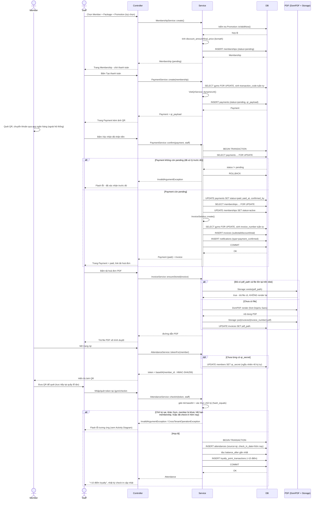

# Sequence Diagram — Workflow mục 26

Cùng nguồn 13 bước với `docs/activity-diagram.md` (xem `docs/day2-workflow-notes.md`), nhưng tập trung vào **luồng chính (happy path)** + các nhánh lỗi quan trọng nhất gộp trong khối `alt` (chi tiết đầy đủ MỌI rẽ nhánh đã có ở Activity Diagram, không lặp lại ở đây cho đỡ rối). Lane theo đúng yêu cầu: Member / Staff / Controller / Service / DB / PDF.

`Controller` đại diện chung cho `MembershipController`/`PaymentController`/`InvoiceController`/`AttendanceController`; `Service` đại diện chung cho `MembershipService`/`PaymentService`/`VietQrService`/`InvoiceService`/`AttendanceService` — tên class cụ thể ghi trong nội dung message.

## Ghi chú đọc diagram

- 2 khối `alt` lớn (xác nhận thanh toán, check-in) là **đúng 2 giao dịch nguyên tử thật** trong code (`DB::transaction()` trong `PaymentService::confirm()` và `AttendanceService::checkIn()`) — nhánh lỗi bên trong luôn kết thúc bằng rollback ngầm định (Laravel tự rollback khi closure của `DB::transaction()` ném exception), không có commit một phần.
- `opt` (không phải `alt`) ở bước sinh `qr_secret` vì đây là nhánh **không bắt buộc phải có** (chỉ chạy lần đầu member xem QR), không phải 2 lựa chọn loại trừ nhau.
- Muốn xem đầy đủ **mọi** nhánh từ chối riêng lẻ (5 rẽ nhánh ở bước check-in, rẽ nhánh discount_type, v.v.) — xem `docs/activity-diagram.md`, đúng vai trò của 2 diagram: Sequence tả *thứ tự gọi giữa các lớp*, Activity tả *toàn bộ luồng quyết định nghiệp vụ*.
