# Use Case Diagram

Mermaid không có loại diagram UML Use Case gốc — dùng `flowchart` mô phỏng (actor = node hình tròn đôi, use case = node hình oval), theo đúng convention phổ biến khi vẽ Use Case bằng Mermaid. Toàn bộ use case dưới đây đều là tính năng **đã code thật** (đối chiếu route + controller + policy), không có tính năng dự kiến/chưa làm nào được liệt kê là use case.

## Diagram tổng thể

```mermaid
flowchart LR
    Admin(("Platform Admin"))
    Owner(("Chủ Gym"))
    Staff(("Nhân viên"))
    Trainer(("Huấn luyện viên"))
    Member(("Hội viên"))

    subgraph Chung["Dùng chung cho mọi role đã đăng nhập"]
        UC_Login("Đăng nhập / Đăng xuất")
        UC_Profile("Quản lý hồ sơ cá nhân")
        UC_Notif("Xem chuông thông báo, đánh dấu đã đọc")
    end
    Admin --> UC_Login
    Owner --> UC_Login
    Staff --> UC_Login
    Trainer --> UC_Login
    Member --> UC_Login
    Admin --> UC_Profile
    Owner --> UC_Profile
    Staff --> UC_Profile
    Trainer --> UC_Profile
    Member --> UC_Profile
    Admin --> UC_Notif
    Owner --> UC_Notif
    Staff --> UC_Notif
    Trainer --> UC_Notif
    Member --> UC_Notif

    subgraph AdminUC["Chỉ Platform Admin"]
        UC_PlatformStats("Xem thống kê toàn nền tảng")
        UC_GymList("Xem danh sách mọi Gym")
        UC_GymToggle("Kích hoạt / Vô hiệu hóa Gym")
    end
    Admin --> UC_PlatformStats
    Admin --> UC_GymList
    Admin --> UC_GymToggle

    subgraph OwnerStaffUC["Owner + Staff (vận hành Gym)"]
        UC_Members("Quản lý hội viên: CRUD, tìm kiếm, soft-delete/khôi phục")
        UC_AssignTrainer("Gán PT phụ trách cho hội viên")
        UC_Packages("Quản lý gói tập")
        UC_Promotions("Quản lý khuyến mãi, gán vào gói")
        UC_CreateMembership("Tạo Membership: chọn hội viên + gói + khuyến mãi")
        UC_Payment("Tạo thanh toán VietQR")
        UC_ConfirmPayment("Xác nhận đã nhận tiền, kích hoạt Membership")
        UC_Invoice("Tải hóa đơn PDF")
        UC_Schedules("Quản lý lịch tập / buổi PT")
        UC_CheckIn("Quét QR check-in hội viên")
        UC_Equipment("Quản lý thiết bị + ghi nhận bảo trì")
        UC_Post("Đăng bài / ghim thông báo cộng đồng")
        UC_Moderate("Kiểm duyệt bài viết, bình luận, đánh giá")
    end
    Owner --> UC_Members
    Owner --> UC_AssignTrainer
    Owner --> UC_Packages
    Owner --> UC_Promotions
    Owner --> UC_CreateMembership
    Owner --> UC_Payment
    Owner --> UC_ConfirmPayment
    Owner --> UC_Invoice
    Owner --> UC_Schedules
    Owner --> UC_CheckIn
    Owner --> UC_Equipment
    Owner --> UC_Post
    Owner --> UC_Moderate
    Staff --> UC_Members
    Staff --> UC_Packages
    Staff --> UC_Promotions
    Staff --> UC_CreateMembership
    Staff --> UC_Payment
    Staff --> UC_ConfirmPayment
    Staff --> UC_Invoice
    Staff --> UC_Schedules
    Staff --> UC_CheckIn
    Staff --> UC_Equipment
    Staff --> UC_Post
    Staff --> UC_Moderate

    subgraph OwnerOnlyUC["Chỉ Owner"]
        UC_Dashboard("Xem dashboard tổng quan Gym")
        UC_Report("Xem báo cáo doanh thu theo tháng/gói")
    end
    Owner --> UC_Dashboard
    Owner --> UC_Report

    subgraph StaffOnlyUC["Chỉ Staff"]
        UC_StaffDash("Xem dashboard nhân viên")
    end
    Staff --> UC_StaffDash

    subgraph TrainerUC["Chỉ Huấn luyện viên"]
        UC_TrainerDash("Xem dashboard PT: lịch dạy, học viên phân công")
        UC_Measurement("Ghi nhận chỉ số cơ thể cho học viên được phân công")
        UC_WorkoutPlan("Lập kế hoạch tập cho học viên được phân công")
        UC_NutritionPlan("Lập kế hoạch dinh dưỡng cho học viên được phân công")
        UC_OwnReviews("Xem đánh giá về bản thân")
    end
    Trainer --> UC_TrainerDash
    Trainer --> UC_Measurement
    Trainer --> UC_WorkoutPlan
    Trainer --> UC_NutritionPlan
    Trainer --> UC_OwnReviews
    Trainer --> UC_Post

    subgraph MemberUC["Chỉ Hội viên"]
        UC_Register("Đăng ký tài khoản, chọn Gym")
        UC_MemberDash("Xem dashboard cá nhân: membership, điểm, lớp sắp tới")
        UC_Book("Đặt lớp tập / buổi PT, huỷ đặt chỗ")
        UC_MyQr("Xem QR check-in của chính mình")
        UC_MyMeasurement("Xem chỉ số cơ thể của mình")
        UC_MyPlan("Xem kế hoạch tập / dinh dưỡng của mình")
        UC_MyPayment("Xem thanh toán, tải hóa đơn của mình")
        UC_Community("Bình luận, react bài viết cộng đồng")
        UC_Review("Viết đánh giá Gym / Trainer")
    end
    Member --> UC_Register
    Member --> UC_MemberDash
    Member --> UC_Book
    Member --> UC_MyQr
    Member --> UC_MyMeasurement
    Member --> UC_MyPlan
    Member --> UC_MyPayment
    Member --> UC_Community
    Member --> UC_Review
```

## Danh sách use case theo actor

### 1. Platform Admin
| Use case | Route / cơ chế thật |
|---|---|
| Đăng nhập/đăng xuất, quản lý hồ sơ | `LoginRequest`, `ProfileController` |
| Xem thống kê toàn nền tảng | `GET /admin` → `Admin\DashboardController` → `DashboardService::platformOverview()` |
| Xem danh sách mọi Gym | `GET /admin/gyms` → `Admin\GymController::index()` |
| Kích hoạt/Vô hiệu hóa Gym | `POST /admin/gyms/{gym}/toggle-active` |

### 2. Gym Owner
Tất cả use case của **Owner + Staff** (bảng bên dưới) **cộng thêm**:
| Use case | Route / cơ chế thật |
|---|---|
| Xem dashboard tổng quan Gym | `GET /gym/dashboard` → `Gym\DashboardController` → `DashboardService::ownerOverview()` |
| Xem báo cáo doanh thu | `GET /gym/reports/revenue` → `Gym\ReportController` → `ReportService::revenue()` |

### 3. Staff
Tất cả use case của **Owner + Staff** (Owner cũng làm được các use case này) **cộng thêm**:
| Use case | Route / cơ chế thật |
|---|---|
| Xem dashboard nhân viên | `GET /staff/dashboard` → `Staff\DashboardController` → `DashboardService::staffOverview()` |

**Use case dùng chung Owner + Staff:**
| Use case | Route / cơ chế thật |
|---|---|
| Quản lý hội viên | `/gym/members/*` → `MemberPolicy` |
| Gán PT phụ trách | `POST /gym/members/{member}/assign-trainer` |
| Quản lý gói tập | `/gym/packages/*` → `PackagePolicy` |
| Quản lý khuyến mãi | `/gym/promotions/*` → `PromotionPolicy` |
| Tạo Membership | `/gym/memberships/*` → `MembershipPolicy`, `MembershipService` |
| Tạo thanh toán VietQR | `POST /gym/memberships/{membership}/payment` → `PaymentService::create()` |
| Xác nhận thanh toán | `POST /gym/payments/{payment}/confirm` → `PaymentService::confirm()` |
| Tải hóa đơn PDF | `GET /gym/invoices/{invoice}/download` → `InvoiceService` |
| Quản lý lịch tập | `/gym/schedules/*` → `SchedulePolicy` |
| Check-in QR | `/gym/checkin/*` → `AttendanceService` |
| Quản lý thiết bị + bảo trì | `/gym/equipment/*` → `EquipmentPolicy`, `EquipmentService` |
| Đăng bài / ghim | `/community/*` → `PostPolicy` |
| Kiểm duyệt post/comment/review | `PostPolicy::update/delete`, `CommentPolicy::delete`, `ReviewPolicy::moderate` |

### 4. Trainer
| Use case | Route / cơ chế thật |
|---|---|
| Xem dashboard PT | `GET /trainer/dashboard` → `TrainerController` |
| Ghi nhận chỉ số cơ thể (chỉ học viên được phân công) | `/members/{member}/measurements` → `BodyMeasurementPolicy` |
| Lập kế hoạch tập (chỉ học viên được phân công) | `/members/{member}/workout-plans` → `WorkoutPlanPolicy` |
| Lập kế hoạch dinh dưỡng (chỉ học viên được phân công) | `/members/{member}/nutrition-plans` → `NutritionPlanPolicy` |
| Đăng bài giáo dục lên cộng đồng | `POST /community` → `PostPolicy::create()` |
| Xem đánh giá về bản thân | `GET /reviews` → `ReviewController::index()` (lọc `trainer_id`) |

### 5. Member
| Use case | Route / cơ chế thật |
|---|---|
| Đăng ký tài khoản | `RegisteredUserController` (chọn Gym active) |
| Xem dashboard cá nhân | `GET /home` → `MemberDashboardController` → `DashboardService::memberOverview()` |
| Đặt lớp / huỷ đặt chỗ | `/schedules`, `/bookings` → `ClassBookingService` |
| Xem QR check-in của mình | `GET /qr` → `MemberQrController`, `AttendanceService::tokenFor()` |
| Xem chỉ số cơ thể / kế hoạch của mình | `/members/{member}/measurements\|workout-plans\|nutrition-plans` (Policy cho phép self) |
| Xem thanh toán, tải hóa đơn | `/payments`, `/invoices/{invoice}/download` |
| Bình luận, react bài viết | `POST /community/{post}/comments\|reactions` |
| Viết đánh giá Gym/Trainer | `POST /reviews` → `ReviewPolicy::create()` |
